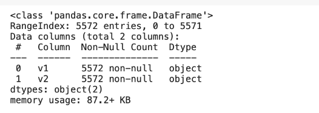
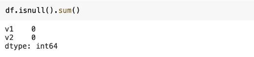
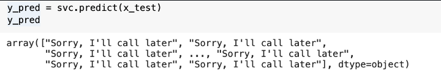
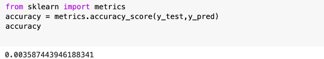

# Implementation-of-SVM-For-Spam-Mail-Detection

## AIM:
To write a program to implement the SVM For Spam Mail Detection.

## Equipments Required:
1. Hardware – PCs
2. Anaconda – Python 3.7 Installation / Jupyter notebook

## Algorithm
1. Import the required packages.
2. Import the dataset to operate on.
3. Split the dataset.
4. Predict the required output.
5. End the program.

## Program:
```
/*
Program to implement the SVM For Spam Mail Detection..
Developed by: AKSHITH JOBIRIN S
RegisterNumber: 212220040007
*/
import chardet
file = 'spam.csv'
with open(file,'rb') as rawdata:
  result= chardet.detect(rawdata.read(100000))
result

import pandas as pd
import matplotlib.pyplot as plt

data = pd.read_csv('Spam.csv',encoding='latin-1')
df = data.drop(['Unnamed: 2','Unnamed: 3','Unnamed: 4'],axis=1)

df.head()

df.info()

df.isnull().sum()

x=df["v1"].values
y=df["v2"].values

from sklearn.model_selection import train_test_split
x_train,x_test,y_train,y_test = train_test_split(x,y,test_size = 0.2,random_state=0)

from sklearn.feature_extraction.text import CountVectorizer
cv = CountVectorizer()

x_train=cv.fit_transform(x_train)
x_test = cv.transform(x_test)

from sklearn.svm import SVC
svc = SVC()
svc.fit(x_train,y_train)

y_pred = svc.predict(x_test)
y_pred

from sklearn import metrics
accuracy = metrics.accuracy_score(y_test,y_pred)
accuracy

```

## Output:

### 1. data.head():


### 2. data.info():



### 3.data.isnull().sum():



### 4. Y_prediction Value:



### 5. Accuracy Value:



## Result:
Thus the program to implement the SVM For Spam Mail Detection is written and verified using python programming.
